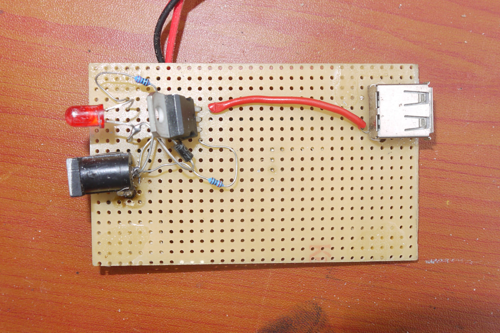

# DIY Power Bank

At the heart of this power bank circuit, are small 3.7V lithium- ion cells that are salvaged out of old broken lamps about 2600mah each.

_Materials_ 

 

Power banks: are used to charge cell phones, tablets, speakers, and even laptops 

# Assembling procedure.

- look for a discarded electronic board
- Remove required electronic materials

  

- level all electronic components
- Cut a rectangular flywood with dimensions (4cm/ 10cm) x2

  

- Cut a side cover plastics/wood  to cover the edges of the power bank

  

- Put all the ports (in/out ) in a circuit board and solder it
- Solder the red LED into the circuit board 
- Glue down the 3 batteries on the flywood

  

> - Solder the voltage regulator into the circuit board:

1 - connect the positive of the batteries to the left terminal of the voltage regulator

2 -  connect the negative of the batteries to the middle terminal of the voltage regulator

3 -  from the voltage regulator, solder a negative out put to a USB port 

4 -  again from the voltage regulator, solder a positive out put to a USB port

5 -  from the charging port ( jack), solder a 10k resistor to the left terminal of the voltage regulator as positive.

6 - Connect the negative of the jack port to the middle terminal of the voltage regulator

7 -  Red LED, connect the negative of the LED to the voltage regulator negative then the positive of the LED to a 220 ohms resistor and to a positive of the jack through a diode.

8 – Attach the batteries to the wood using a glue

9 – attach the circuit board to the wood

10 – attach all side cover to the wood 

11 – Cover the top with a wood same size as the below

12 – test the product 

